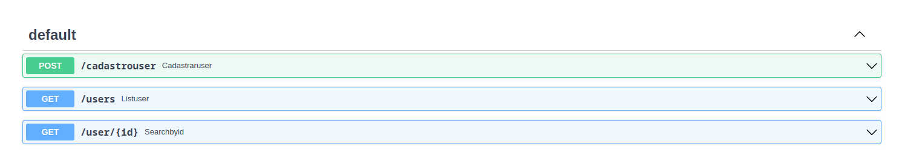

# first-API
Construindo a minha primeira API utilizando a linguagem python, API bem simples desenvolvida somente a fins de aprendizagem da linguagem Python e do Framework FastAPI.

## Detalhes da API
Contém 3 'funcionalidades':
* Cadastrar um usuário
* Listar usuários
* Buscar usuários utilizando o ID.

